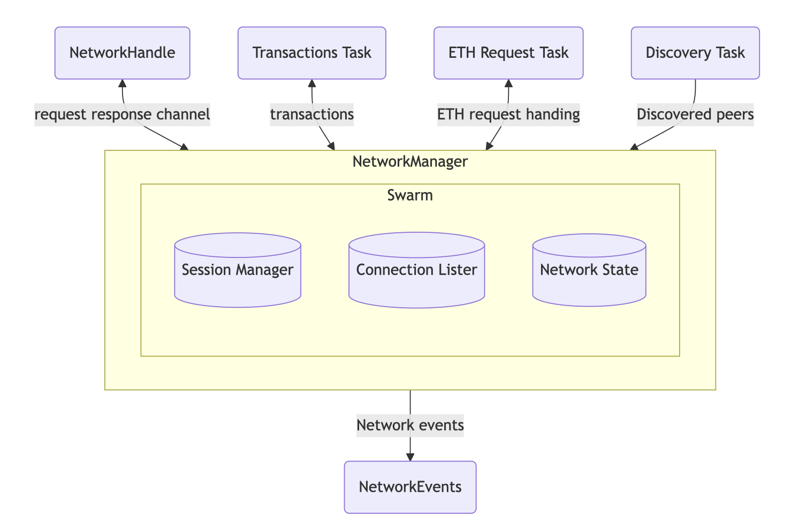

# Network Manager
[File : crates/net/network/src/manager.rs](https://github.com/paradigmxyz/reth/blob/main/crates/net/network/src/manager.rs)

- 위 그림에서 알 수 있듯이 `NetworkManager`는 이더리움 네트워크에서 네트워크 연결을 관리한다.
- `peer 연결`, `세션 관리`, `블록 전파`, `트랜잭션 처리`

### 1. Network Manager 구조체 및 구현
```Rust
pub struct NetworkManager {
    // peer 간 통신 처리, peer 연결 관리, 네트워크 상태 유지
    swarm: Swarm,
    // 외부에서 네트워크 상태를 조회하거나 데이터를 요청할 때 사용 
    handle: NetworkHandle,
    from_handle_rx: UnboundedReceiverStream<NetworkHandleMessage>,
    // 새로운 블록을 가져오고 검증
    block_import: Box<dyn BlockImport>,
    // 네트워크에서 발생하는 이벤트 다른 component에 알림
    event_sender: EventSender<NetworkEvent>,
    to_transactions_manager: Option<UnboundedMeteredSender<NetworkTransactionEvent>>,
    to_eth_request_handler: Option<mpsc::Sender<IncomingEthRequest>>,
    // 현재 네트워크에 연결된 피어 수 추적
    num_active_peers: Arc<AtomicUsize>,
    metrics: NetworkMetrics,
    disconnect_metrics: DisconnectMetrics,
}
```
#### ① 생성 및 초기화 
```Rust
pub async fn new<C: BlockNumReader + 'static>(config: NetworkConfig<C>) -> Result<Self, NetworkError>
pub async fn builder<C: BlockNumReader + 'static>(config: NetworkConfig<C>) -> Result<NetworkBuilder<(), ()>, NetworkError>
pub const fn into_builder(self) -> NetworkBuilder<(), ()>
```
- `new` : 새로운 인스턴스 생성
- `builder` : `NetworkManager`와 `NetworkBuilder` 생성
- `into_builder` : `NetworkBuilder`로 전환해 네트워크 구성 요소 추가 설정 

#### ② 네트워크 상태 및 metrics 관련
```Rust
// 현재 네트워크가 수신 대기 중인 소켓 주소 반환
pub const fn local_addr(&self) -> SocketAddr
// 현재 연결된 peer 수 반환 
pub fn num_connected_peers(&self) -> usize
// 네트워크에서 사용 중인 peerId 반환
pub fn peer_id(&self) -> &PeerId
// Iterator 사용해서 모든 피어에 대한 정보 반환
pub fn all_peers(&self) -> impl Iterator<Item = NodeRecord> + '_
// 네트워크에서 알고 있는 peer수 반환 
pub fn num_known_peers(&self) -> usize
// 현재 로컬 노드의 네트워크 상태 반환 
pub fn status(&self) -> NetworkStatus
// 네트워크 polling 시 metrics 업데이트
fn update_poll_metrics(&self, start: Instant, poll_durations: NetworkManagerPollDurations)
```

#### ③ Peer 및 Session 관리 
```Rust
// peer로부터 받은 메시지 처리 : 새 블록, transactions, request
fn on_peer_message(&mut self, peer_id: PeerId, msg: PeerMessage)
// NetworkHandle로부터 받은 메시지 처리하고 peer 연결 관리 
fn on_handle_message(&mut self, msg: NetworkHandleMessage)
// 네트워크 이벤트 처리 : 새로운 peer 연결 될 때, 세션 종료 될 때 
fn on_swarm_event(&mut self, event: SwarmEvent)
// 연결된 모든 peer 정보 반환
fn get_peer_infos(&self) -> Vec<PeerInfo>
// 주어진 peerId에 대한 peer 정보 반환
fn get_peer_info_by_id(&self, peer_id: PeerId) -> Option<PeerInfo>
// 여러 peer에 대한 정보 반환
fn get_peer_infos_by_ids(&self, peer_ids: impl IntoIterator<Item = PeerId>) -> Vec<PeerInfo>
// PeersHandle 반환 : peer 세트와 상호작용 가능 
pub fn peers_handle(&self) -> PeersHandle
```
#### ④ 블록 및 트랜잭션 처리 관련 
```Rust
// peer로부터 받은 eth 프로토콜 요청 처리 
fn on_eth_request(&self, peer_id: PeerId, req: PeerRequest)
// peer로부터 수신된 블록 검증 후 네트워크에 반영
fn on_block_import_result(&mut self, outcome: BlockImportOutcome)
// 새로운 블록 생성 시 네트워크에 전파
pub fn announce_new_block(block: Arc<Block>)
```
#### ⑤ 네트워크 제어 및 설정 관련

```Rust
// transactions 관련 이벤트 채널 설정
pub fn set_transactions(&mut self, tx: mpsc::UnboundedSender<NetworkTransactionEvent>)
// EthRequestHandler 이벤트 채널 설정
pub fn set_eth_request_handler(&mut self, tx: 
mpsc::Sender<IncomingEthRequest>)
// RLPx 서브 프로토콜 설정
pub fn add_rlpx_sub_protocol(&mut self, protocol: impl IntoRlpxSubProtocol)
// 종료 신호 받을 때 까지 네트워크 실행
pub async fn run_until_graceful_shutdown<F, R>(mut self, shutdown: GracefulShutdown, shutdown_hook: F) -> R
```
#### ⑥ polling 관련 
```Rust
impl Future for NetworkManager {
    type Output = ();
    fn poll(self: Pin<&mut Self>, cx: &mut Context<'_>) -> Poll<Self::Output>
}
```
- `poll`: `NetworkManager`가 계속해서 네트워크 상태를 갱신하고, 발생 이벤트 처리하는 루프