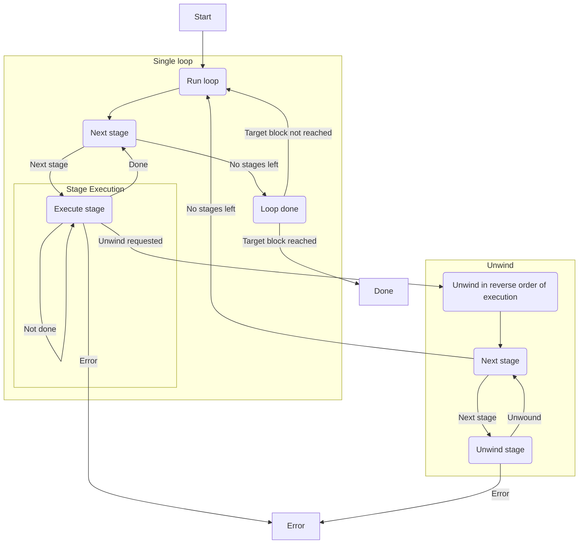

# Stages

The `stages` lib plays a central role in syncing the node, maintaining state, updating the database and more.

When the node is first started, a new `Pipeline` is initialized and all of the stages are added into `Pipeline.stages`. Then, the `Pipeline::run` function is called, which starts the pipeline, executing all of the stages continuously in an infinite loop. This process syncs the chain, keeping everything up to date with the chain tip.
# Stages api
stage execution flow

## stages [crates/stages/api/src/stage.rs]
The `Stage` trait defines the behavior and requirements for a stage in the syncing process of a node.

1. **Purpose**:
    
    - A stage represents a segmented part of the syncing process, handling specific tasks like downloading headers or executing transactions and persisting results to a database.
2. **Requirements**:
    
    - Each stage must have a unique ID (`id`) and implement methods to "roll forwards" (`execute`) and "roll back" (`unwind`).
    - Stages are executed serially as part of a pipeline.
    - Stages receive a `DBProvider` for interacting with the database.
3. **Methods**:
    
    - `id`: Returns the unique ID of the stage.
    - `poll_execute_ready`: Indicates if the stage is ready to execute a given range. It should handle any asynchronous tasks or communication needed before execution.
    - `execute`: Executes the stage, writing necessary data to the database.
    - `post_execute_commit`: Hook called after execution for any post-execution actions.
    - `unwind`: Rolls back the stage, typically used when an error occurs or to revert changes.
    - `post_unwind_commit`: Hook called after unwinding for any post-unwind actions.
4. **Additional Traits**:
    
    - `StageExt`: An extension trait for `Stage` that provides a utility method `execute_ready` to simplify invoking `poll_execute_ready` with a `Future` output.
5. **Concurrency and Asynchronicity**:
    
    - The trait is designed to handle asynchronous operations, as seen in `poll_execute_ready` and `execute_ready`, allowing stages to manage resources and handle errors effectively.

By implementing the `Stage` trait for different stage types, the syncing process can be broken down into manageable units, each responsible for specific tasks and ensuring data integrity throughout the process.

### SyncMetrics

The `SyncMetrics` module is designed to handle and report metrics related to the synchronization process. The `SyncMetrics` module is composed of several components that work together to collect, process, and report metrics. These components include `MetricEvent`, `MetricEventsSender`, `MetricsListener`, and the `SyncMetrics` itself.

### Components

1. **MetricEvent**:
    
    - This enum defines the types of events that can be reported. The two main types of events are:
        - `SyncHeight { height }`: Indicates the current height of the synchronization process.
        - `StageCheckpoint { stage_id, checkpoint, max_block_number }`: Represents a checkpoint in a specific stage of the synchronization process.
2. **MetricEventsSender**:
    
    - This is a sender channel used to send `MetricEvent` instances to the `MetricsListener`.
3. **MetricsListener**:
    
    - This struct listens for `MetricEvent` instances and processes them to update the metrics.
    - It implements the `Future` trait, allowing it to be polled in an asynchronous context.

### How It Works

1. **Event Handling**:
    
    - The `handle_event` method in `MetricsListener` is responsible for processing incoming `MetricEvent` instances.
    - When a `SyncHeight` event is received, it triggers the creation of `StageCheckpoint` events for all stages.
    - When a `StageCheckpoint` event is received, it updates the metrics for the specified stage.
    
    ```rust
    fn handle_event(&mut self, event: MetricEvent) {
        trace!(target: "sync::metrics", ?event, "Metric event received");
        match event {
            MetricEvent::SyncHeight { height } => {
                for stage_id in StageId::ALL {
                    self.handle_event(MetricEvent::StageCheckpoint {
                        stage_id,
                        checkpoint: StageCheckpoint {
                            block_number: height,
                            stage_checkpoint: None,
                        },
                        max_block_number: Some(height),
                    });
                }
            }
            MetricEvent::StageCheckpoint { stage_id, checkpoint, max_block_number } => {
                let stage_metrics = self.sync_metrics.get_stage_metrics(stage_id);
    
                stage_metrics.checkpoint.set(checkpoint.block_number as f64);
    
                let (processed, total) = match checkpoint.entities() {
                    Some(entities) => (entities.processed, Some(entities.total)),
                    None => (checkpoint.block_number, max_block_number),
                };
    
                stage_metrics.entities_processed.set(processed as f64);
    
                if let Some(total) = total {
                    stage_metrics.entities_total.set(total as f64);
                }
            }
        }
    }
    ```
    
2. **Polling for Events**:
    
    - The `MetricsListener` struct implements the `Future` trait, which allows it to be polled in an asynchronous context.
    - The `poll` method continuously checks for new events from the `events_rx` channel and processes them using the `handle_event` method.
    
    ```rust
    impl Future for MetricsListener {
        type Output = ();
    
        fn poll(self: Pin<&mut Self>, cx: &mut Context<'_>) -> Poll<Self::Output> {
            let this = self.get_mut();
    
            // Loop until we drain the `events_rx` channel
            loop {
                let Some(event) = ready!(this.events_rx.poll_recv(cx)) else {
                    // Channel has closed
                    return Poll::Ready(())
                };
    
                this.handle_event(event);
            }
        }
    }
    ```
    
3. **Integration with Pipeline**:
    
    - The `SyncMetrics` module is integrated into the pipeline process. For example, when a stage is unwound, a `StageCheckpoint` event is sent to update the metrics.
    
    ```rust
    {
        Ok(unwind_output) => {
            checkpoint = unwind_output.checkpoint;
            info!(
                target: "sync::pipeline",
                stage = %stage_id,
                unwind_to = to,
                progress = checkpoint.block_number,
                done = checkpoint.block_number == to,
                "Stage unwound"
            );
            if let Some(metrics_tx) = &mut self.metrics_tx {
                let _ = metrics_tx.send(MetricEvent::StageCheckpoint {
                    stage_id,
                    checkpoint,
                    // We assume it was set in the previous execute iteration, so it
                    // doesn't change when we unwind.
                    max_block_number: None,
                });
            }
            provider_rw.save_stage_checkpoint(stage_id, checkpoint)?;
    
            self.event_sender
                .notify(PipelineEvent::Unwound { stage_id, result: unwind_output });
    
            // update finalized block if needed
            let last_saved_finalized_block_number =
                provider_rw.last_finalized_block_number()?;
    
            // If None, that means the finalized block is not written so we should
    ```

# Stages pipeline
The `Pipeline` is designed to manage and execute a series of stages in a synchronized manner. The `Pipeline` is responsible for executing a sequence of stages, each of which performs a specific task. The stages are executed serially, meaning one after the other, from the current local chain tip to the external chain tip. The pipeline continues to run until it reaches the chain tip, and it can be configured to run repeatedly unless explicitly stopped.

### Key Components

1. **ProviderFactory**:
    
    - This is used to create a database provider (`provider_rw`) that stages use to interact with the database.
2. **Stages**:
    
    - A vector of stages (`stages`) that are configured to run in a specific order. Each stage is a boxed trait object that implements the `Stage` trait.
3. **EventSender**:
    
    - Used to send events (`PipelineEvent`) that notify about the progress and state of the pipeline.
4. **PipelineProgress**:
    
    - Keeps track of the progress of the pipeline, including the minimum block number achieved by any stage.
5. **Tip Sender**:
    
    - A channel (`tip_tx`) used to set the current chain tip for reverse synchronization.
6. **Metrics Sender**:
    
    - Used to send metrics events.

### Key Methods

1. **builder()**:
    
    - Constructs a pipeline using a `PipelineBuilder`.
2. **minimum_block_number()**:
    
    - Returns the minimum block number achieved by any stage during the execution of the pipeline.
3. **set_tip()**:
    
    - Sets the chain tip for reverse synchronization.
4. **events()**:
    
    - Returns an event stream to listen for pipeline events.

### Execution Flow

1. **Initialization**:
    
    - The pipeline is initialized using the `PipelineBuilder`, which sets up the stages, provider factory, and other components.
2. **Stage Execution**:
    
    - The pipeline iterates through each stage and executes it using the `execute` method. The stage uses the `provider_rw` to interact with the database.
    - During execution, the pipeline sends notifications about its progress using the `event_sender`.
3. **Handling Results**:
    
    - The result of each stage execution is captured. If the execution is successful, the pipeline moves to the next stage. If there is an error, the pipeline may unwind the stages in reverse order to handle the error.
4. **Repeat Execution**:
    
    - After all stages have been executed, the pipeline can be configured to run again unless explicitly stopped.

## mod
This code defines a `Pipeline` struct and its associated methods for managing and executing a staged synchronization pipeline. The pipeline processes stages serially, handles errors by unwinding stages if necessary, and supports continuous synchronization.

### Pipeline struct
```rust
pub struct Pipeline<N: ProviderNodeTypes> {
provider_factory: ProviderFactory<N>,// Factory for creating database providers

/// All configured stages in the order they will be executed.
stages: Vec<BoxedStage<<ProviderFactory<N> as DatabaseProviderFactory>::ProviderRW>>,

max_block: Option<BlockNumber>, // Maximum block number to sync to

// Producer for static files
static_file_producer: StaticFileProducer<ProviderFactory<N>>,

// Sender for events the pipeline emits.
event_sender: EventSender<PipelineEvent>,

/// Keeps track of the progress of the pipeline.
progress: PipelineProgress,

/// A receiver for the current chain tip to sync to.
tip_tx: Option<watch::Sender<B256>>,

metrics_tx: Option<MetricEventsSender>, // Optional sender for metric events
}
```

### Pipeline impl
This code defines methods for the `Pipeline` struct, which manages the execution of various stages in a blockchain synchronization process. It includes methods for constructing a pipeline, setting synchronization tips, registering metrics, running the pipeline, and handling events.

## Example Usage

```rust
let pipeline = Pipeline::builder().build();
pipeline.set_tip(tip);
let events = pipeline.events();
let result = pipeline.run_as_fut(Some(PipelineTarget::Sync(tip))).await;
```

## Code Analysis

### Inputs

- `self`: Reference to the `Pipeline` instance.
- `tip`: A `B256` value representing the chain tip for reverse sync.
- `target`: An optional `PipelineTarget` specifying the synchronization target.

---

### functions

1. **`builder()`**:
    
    - Constructs a new `PipelineBuilder` using the associated type `ProviderRW` from the `ProviderFactory` associated with the generic type `N`.
    - Example usage:
        
        ```rust
        let pipeline_builder = Pipeline::<MyProvider>::builder();
        ```
        
2. **`minimum_block_number()`**:
    
    - Returns the minimum block number achieved by any stage during the execution of the pipeline.
    - Example usage:
        
        ```rust
        if let Some(min_block_number) = pipeline.minimum_block_number() {
            println!("Minimum block number: {}", min_block_number);
        }
        ```
        
3. **`set_tip(tip: B256)`**:
    
    - Sets the chain tip for reverse synchronization using the provided `tip` value.
    - Example usage:
        
        ```rust
        let tip = B256::new(); // Assuming B256 is a valid type
        pipeline.set_tip(tip);
        ```
        
4. **`events()`**:
    
    - Returns an event stream (`EventStream`) for pipeline events.
    - Example usage:
        
        ```rust
        let event_stream = pipeline.events();
        ```
        
5. **`register_metrics()`**:
    
    - Registers progress metrics for each registered stage in the pipeline.
    - Example usage:
        
        ```rust
        pipeline.register_metrics().unwrap_or_else(|err| {
            eprintln!("Error registering metrics: {:?}", err);
        });
        ```
        
6. **`run_as_fut(target: Option<PipelineTarget>)`**:
    
    - Runs the pipeline asynchronously until it reaches the specified `target`.
    - Example usage:
        
        ```rust
        let target = Some(PipelineTarget::Sync(my_tip));
        let fut = pipeline.run_as_fut(target);
        ```
        
7. **`run()`**:
    
    - Runs the pipeline in an infinite loop, terminating early if a maximum block is specified.
    - Example usage:
        
        ```rust
        if let Err(err) = pipeline.run().await {
            eprintln!("Error running pipeline: {:?}", err);
        }
        ```
        
8. **`run_loop()`**:
    
    - Executes each stage in the pipeline, handling progress and errors, and returns the control flow after running the pipeline.
    - Example usage:
        
        ```rust
        let control_flow = pipeline.run_loop().await.unwrap_or_else(|err| {
            eprintln!("Error running pipeline loop: {:?}", err);
            ControlFlow::Terminate
        });
        ```
        
9. **`move_to_static_files()`**:
    
    - Moves data from the database to static files for specific segments based on stage checkpoints.
    - Example usage:
        
        ```rust
        pipeline.move_to_static_files().unwrap_or_else(|err| {
            eprintln!("Error moving data to static files: {:?}", err);
        });
        ```
        
10. **`unwind(to: BlockNumber, bad_block: Option<BlockNumber>)`**:
    
    - Unwinds the stages in reverse order up to the target block. If unwinding is due to a bad block, the number of that block should be specified.
    - Example usage:
        
        ```rust
        let target_block = 1000;
        let bad_block = Some(500);
        pipeline.unwind(target_block, bad_block).unwrap_or_else(|err| {
            eprintln!("Error unwinding stages: {:?}", err);
        });
        ```
        
11. **`execute_stage_to_completion(previous_stage: Option<BlockNumber>, stage_index: usize)`**:
    
    - Executes a single stage in the pipeline to completion, handling progress and errors.
    - Example usage:
        
        ```rust
        let stage_index = 0;
        let control_flow = pipeline.execute_stage_to_completion(None, stage_index).await.unwrap_or_else(|err| {
            eprintln!("Error executing stage: {:?}", err);
            ControlFlow::Terminate
        });
        ```

---

### Outputs

- `PipelineBuilder`: A builder for constructing a `Pipeline`.
- `Option<u64>`: The minimum block number achieved.
- `EventStream<PipelineEvent>`: A stream of pipeline events.
- `PipelineFut<N>`: A future that returns the pipeline and its result.
- `Result<(), PipelineError>`: The result of running the pipeline.
- `Result<ControlFlow, PipelineError>`: The control flow after running the pipeline loop.

## PipelineBuilder
The `PipelineBuilder` struct is designed to facilitate the construction of a `Pipeline` in a modular and flexible manner. Here's a detailed explanation of how `PipelineBuilder` works:

### Structure Definition

```rust
pub struct PipelineBuilder<Provider> {
    stages: Vec<BoxedStage<Provider>>,
    max_block: Option<BlockNumber>,
    tip_tx: Option<watch::Sender<B256>>,
    metrics_tx: Option<MetricEventsSender>,
}
```

- **stages**: A vector that holds the stages of the pipeline in the order they will be executed. Each stage is boxed to allow for dynamic dispatch.
- **max_block**: An optional maximum block number to which the pipeline will sync.
- **tip_tx**: An optional sender for the current chain tip to sync to.
- **metrics_tx**: An optional sender for metric events.

### Methods

#### Adding Stages

```rust
impl<Provider> PipelineBuilder<Provider> {
    pub fn add_stage<S>(mut self, stage: S) -> Self
    where
        S: Stage<Provider> + 'static,
    {
        self.stages.push(Box::new(stage));
        self
    }

    pub fn add_stages<Set: StageSet<Provider>>(mut self, set: Set) -> Self {
        for stage in set.builder().build() {
            self.stages.push(stage);
        }
        self
    }
}
```

- **add_stage**: Adds a single stage to the pipeline. The stage must implement the `Stage` trait for the given `Provider`.
- **add_stages**: Adds a set of stages to the pipeline. The stages can be grouped into a set using a `StageSet`.

#### Configuration Methods

```rust
impl<Provider> PipelineBuilder<Provider> {
    pub const fn with_max_block(mut self, block: BlockNumber) -> Self {
        self.max_block = Some(block);
        self
    }

    pub fn with_tip_sender(mut self, tip_tx: watch::Sender<B256>) -> Self {
        self.tip_tx = Some(tip_tx);
        self
    }

    pub fn with_metrics_tx(mut self, metrics_tx: MetricEventsSender) -> Self {
        self.metrics_tx = Some(metrics_tx);
        self
    }
}
```

- **with_max_block**: Sets the maximum block number for the pipeline.
- **with_tip_sender**: Sets the sender for the current chain tip.
- **with_metrics_tx**: Sets the sender for metric events.

#### Building the Pipeline

```rust
impl<Provider> PipelineBuilder<Provider> {
    pub fn build<N>(
        self,
        provider_factory: ProviderFactory<N>,
        static_file_producer: StaticFileProducer<ProviderFactory<N>>,
    ) -> Pipeline<N>
    where
        N: ProviderNodeTypes,
        ProviderFactory<N>: DatabaseProviderFactory<ProviderRW = Provider>,
    {
        let Self { stages, max_block, tip_tx, metrics_tx } = self;
        Pipeline {
            provider_factory,
            stages,
            max_block,
            static_file_producer,
            tip_tx,
            event_sender: Default::default(),
            progress: Default::default(),
            metrics_tx,
        }
    }
}
```

- **build**: Consumes the `PipelineBuilder` and constructs a `Pipeline` using the provided `ProviderFactory` and `StaticFileProducer`. This method finalizes the configuration and returns a fully constructed `Pipeline`.

### Default and Debug Implementations

```rust
impl<Provider> Default for PipelineBuilder<Provider> {
    fn default() -> Self {
        Self { stages: Vec::new(), max_block: None, tip_tx: None, metrics_tx: None }
    }
}

impl<Provider> std::fmt::Debug for PipelineBuilder<Provider> {
    fn fmt(&self, f: &mut std::fmt::Formatter<'_>) -> std::fmt::Result {
        f.debug_struct("PipelineBuilder")
            .field("stages", &self.stages.iter().map(|stage| stage.id()).collect::<Vec<StageId>>())
            .field("max_block", &self.max_block)
            .finish()
    }
}
```

- **Default**: Provides a default implementation for `PipelineBuilder`, initializing it with empty or `None` values.
- **Debug**: Implements the `Debug` trait for `PipelineBuilder`, allowing it to be formatted using the `{:?}` formatter. This is useful for debugging purposes.

### Usage in Pipeline

```rust
impl<N: ProviderNodeTypes> Pipeline<N> {
    pub fn builder() -> PipelineBuilder<<ProviderFactory<N> as DatabaseProviderFactory>::ProviderRW> {
        PipelineBuilder::default()
    }
}
```

- **builder**: A static method in the `Pipeline` struct that returns a new `PipelineBuilder` initialized with default values.

## ControlFlow
The `ControlFlow` enum is crucial for managing the execution flow of the pipeline. It helps in determining whether the pipeline should continue, unwind, or handle no progress. The `run_loop` method uses `ControlFlow` to execute stages, update progress, and handle different execution states effectively. The `PipelineProgress` struct aids in tracking and updating the pipeline's progress, ensuring smooth execution.
### Enum Definition

The `ControlFlow` enum is defined with three variants:

1. **Unwind**:
    
    - This variant indicates that an unwind operation is required. It contains:
        - `target`: The block number to which the pipeline should unwind.
        - `bad_block`: The block that caused the unwind, encapsulated in a `Box<SealedHeader>`.
2. **Continue**:
    
    - This variant signifies that the pipeline has made progress and should continue executing. It contains:
        - `block_number`: The block number reached by the stage.
3. **NoProgress**:
    
    - This variant indicates that the pipeline made no progress. It contains:
        - `block_number`: An optional block number reached by the stage.

### Methods

The `ControlFlow` enum has several methods to facilitate its usage:

1. **should_continue**:
    
    - This method returns `true` if the pipeline should continue executing stages. It matches against `Continue` and `NoProgress` variants.
    
    ```rust
    pub const fn should_continue(&self) -> bool {
        matches!(self, Self::Continue { .. } | Self::NoProgress { .. })
    }
    ```
    
2. **is_unwind**:
    
    - This method returns `true` if the control flow is `Unwind`.
    
    ```rust
    pub const fn is_unwind(&self) -> bool {
        matches!(self, Self::Unwind { .. })
    }
    ```
    
3. **block_number**:
    
    - This method returns the block number the stage reached if the state is not `Unwind`.
    
    ```rust
    pub const fn block_number(&self) -> Option<BlockNumber> {
        match self {
            Self::Unwind { .. } => None,
            Self::Continue { block_number } => Some(*block_number),
            Self::NoProgress { block_number } => *block_number,
        }
    }
    ```
    

### Usage in Pipeline Execution

The `ControlFlow` enum is used extensively in the `run_loop` method to manage the pipeline's execution flow:

1. **Initialization**:
    
    - The pipeline initializes and prepares to execute stages.
    
    ```rust
    self.move_to_static_files()?;
    ```
    
2. **Stage Execution Loop**:
    
    - The pipeline iterates through its stages, executing each one to completion.
    
    ```rust
    for stage_index in 0..self.stages.len() {
        let stage = &self.stages[stage_index];
        let stage_id = stage.id();
        let next = self.execute_stage_to_completion(previous_stage, stage_index).await?;
    ```
    
3. **Handling Control Flow**:
    
    - Based on the `ControlFlow` returned by `execute_stage_to_completion`, the pipeline updates its progress or handles an unwind.
    
    ```rust
    match next {
        ControlFlow::NoProgress { block_number } => {
            if let Some(block_number) = block_number {
                self.progress.update(block_number);
            }
        }
        ControlFlow::Continue { block_number } => self.progress.update(block_number),
        ControlFlow::Unwind { target, bad_block } => {
            self.unwind(target, Some(bad_block.number))?;
            return Ok(ControlFlow::Unwind { target, bad_block })
        }
    }
    ```
    
4. **Updating Progress**:
    
    - The pipeline updates its progress based on the block number reached by the stage.
    
    ```rust
    previous_stage = Some(
        self.provider_factory
            .provider()?
            .get_stage_checkpoint(stage_id)?
            .unwrap_or_default()
            .block_number,
    );
    ```
    
5. **Final Control Flow**:
    
    - The pipeline determines the next control flow step based on the progress.
    
    ```rust
    Ok(self.progress.next_ctrl())
    ```
    

### Pipeline Progress

The `PipelineProgress` struct helps in tracking the progress of the pipeline:

- **Fields**:
    
    - `block_number`: The block number reached by the stage.
    - `maximum_block_number`: The maximum block number achieved by any stage.
    - `minimum_block_number`: The minimum block number achieved by any stage.
- **Methods**:
    
    - `update`: Updates the progress with a new block number.
    - `next_ctrl`: Determines the next control flow step based on the current progress.
    
    ```rust
    pub(crate) const fn next_ctrl(&self) -> ControlFlow {
        match self.block_number {
            Some(block_number) => ControlFlow::Continue { block_number },
            None => ControlFlow::NoProgress { block_number: None },
        }
    }
    ```

## PipelineEvent
The `PipelineEvent` enum represents various events that can occur during the execution of a pipeline. Each variant of the enum corresponds to a specific type of event, and it carries relevant data associated with that event. Here's a detailed explanation of each variant:

1. **Prepare**:
    
    - **Description**: This event is emitted when a stage is about to be prepared for a run.
    - **Fields**:
        - `pipeline_stages_progress`: Indicates the progress of the pipeline stages.
        - `stage_id`: Identifies the stage that is about to be run.
        - `checkpoint`: The previous checkpoint of the stage, if any.
        - `target`: The block number up to which the stage is running, if known.
2. **Run**:
    
    - **Description**: This event is emitted when a stage is about to be run.
    - **Fields**:
        - `pipeline_stages_progress`: Indicates the progress of the pipeline stages.
        - `stage_id`: Identifies the stage that is about to be run.
        - `checkpoint`: The previous checkpoint of the stage, if any.
        - `target`: The block number up to which the stage is running, if known.
3. **Ran**:
    
    - **Description**: This event is emitted when a stage has run a single time.
    - **Fields**:
        - `pipeline_stages_progress`: Indicates the progress of the pipeline stages.
        - `stage_id`: Identifies the stage that was run.
        - `result`: The result of executing the stage, encapsulated in an `ExecOutput`.
4. **Unwind**:
    
    - **Description**: This event is emitted when a stage is about to be unwound.
    - **Fields**:
        - `stage_id`: Identifies the stage that is about to be unwound.
        - `input`: The unwind parameters, encapsulated in an `UnwindInput`.
5. **Error**:
    
    - **Description**: This event is emitted when a stage encounters an error either during execution or unwinding.
    - **Fields**:
        - `stage_id`: Identifies the stage that encountered an error.
6. **Skipped**:
    
    - **Description**: This event is emitted when a stage was skipped due to its run conditions not being met. The documentation provides several reasons why a stage might be skipped:
        - The stage might have progressed beyond the point of the target block.
        - The stage might not need to be unwound since it has not progressed past the unwind target.
        - The stage requires that the pipeline has reached the tip, but it has not done so yet.
    - **Fields**:
        - `stage_id`: Identifies the stage that was skipped.

### Example Usage

The `PipelineEvent` enum is used to track and handle different stages of the pipeline's execution. Here are some examples of how these events might be instantiated:

```rust
let events = [
    PipelineEvent::Prepare {
        pipeline_stages_progress: PipelineStagesProgress { current: 1, total: 2 },
        stage_id: StageId::Other("A"),
        checkpoint: None,
        target: Some(10),
    },
    PipelineEvent::Run {
        pipeline_stages_progress: PipelineStagesProgress { current: 1, total: 2 },
        stage_id: StageId::Other("A"),
        checkpoint: None,
        target: Some(10),
    },
    PipelineEvent::Ran {
        pipeline_stages_progress: PipelineStagesProgress { current: 1, total: 2 },
        stage_id: StageId::Other("A"),
        result: ExecOutput { checkpoint: StageCheckpoint::new(20), done: true },
    },
    PipelineEvent::Error { stage_id: StageId::Other("B") },
    PipelineEvent::Skipped { stage_id: StageId::Other("C") },
];
```

### Imports

To use `PipelineEvent` and its associated types, ensure you have the necessary imports:

```rust
use crate::{
    stage::{ExecOutput, UnwindInput, UnwindOutput},
    StageCheckpoint, StageId,
};
use alloy_primitives::BlockNumber;
use std::fmt::{Display, Formatter};
```

This enum provides a structured way to handle and respond to various stages and events in the pipeline, making it easier to manage the pipeline's execution flow and handle errors or special conditions appropriately.

## PipelineProgress
The `PipelineProgress` struct is designed to track the progress of a pipeline in terms of block numbers. It keeps track of the current block number, as well as the minimum and maximum block numbers achieved by any stage during the execution of the pipeline. Here's a detailed explanation of how it works:

### Structure Definition

```rust
#[derive(Debug, Default)]
pub(crate) struct PipelineProgress {
    /// Block number reached by the stage.
    pub(crate) block_number: Option<BlockNumber>,
    /// The maximum block number achieved by any stage during the execution of the pipeline.
    pub(crate) maximum_block_number: Option<BlockNumber>,
    /// The minimum block number achieved by any stage during the execution of the pipeline.
    pub(crate) minimum_block_number: Option<BlockNumber>,
}
```

- `block_number`: This field holds the current block number reached by the stage.
- `maximum_block_number`: This field holds the maximum block number achieved by any stage during the execution of the pipeline.
- `minimum_block_number`: This field holds the minimum block number achieved by any stage during the execution of the pipeline.

### Methods

#### `update`

```rust
impl PipelineProgress {
    pub(crate) fn update(&mut self, block_number: BlockNumber) {
        self.block_number = Some(block_number);
        self.minimum_block_number = opt::min(self.minimum_block_number, block_number);
        self.maximum_block_number = opt::max(self.maximum_block_number, block_number);
    }
}
```

The `update` method updates the `block_number` to the provided value and recalculates the `minimum_block_number` and `maximum_block_number` using the `opt::min` and `opt::max` utility functions, respectively.

- `opt::min`: This function updates the `minimum_block_number` to the smaller of the current `minimum_block_number` and the provided `block_number`.
- `opt::max`: This function updates the `maximum_block_number` to the larger of the current `maximum_block_number` and the provided `block_number`.

#### `next_ctrl`

```rust
impl PipelineProgress {
    /// Get next control flow step
    pub(crate) const fn next_ctrl(&self) -> ControlFlow {
        match self.block_number {
            Some(block_number) => ControlFlow::Continue { block_number },
            None => ControlFlow::NoProgress { block_number: None },
        }
    }
}
```

The `next_ctrl` method determines the next control flow step based on the current `block_number`:

- If `block_number` is `Some`, it returns `ControlFlow::Continue` with the current `block_number`.
- If `block_number` is `None`, it returns `ControlFlow::NoProgress` with `block_number` set to `None`.

## StageSet
The `StageSet` trait and `StageSetBuilder` struct provide a robust framework for managing a collection of stages that need to be executed in a specific order. By using the builder pattern, it allows for flexible configuration, addition, removal, and reordering of stages, making it easier to manage complex workflows with interdependent stages.
### Overview

1. **Definition**:
    
    - `StageSet` is a trait that defines a set of stages that can be configured, added, removed, or overridden.
    - It provides methods to build and configure these stages using a builder pattern.
2. **Purpose**:
    
    - To group stages that have dependencies on each other.
    - To provide a flexible way to manage these stages, including adding, removing, and reordering them.

### Key Components

1. **StageSet Trait**:
    
    - The `StageSet` trait defines two primary methods:
        - `builder(self) -> StageSetBuilder<Provider>`: This method returns a `StageSetBuilder` which is used to configure the stages in the set.
        - `set<S: Stage<Provider> + 'static>(self, stage: S) -> StageSetBuilder<Provider>`: This method overrides a given stage in the set. It panics if the stage is not in the set.
2. **StageSetBuilder**:
    
    - The `StageSetBuilder` is a helper struct that provides methods to add, remove, and reorder stages within the set.
    - Key methods include:
        - `add_stage<S: Stage<Provider> + 'static>(self, stage: S) -> Self`: Adds a stage to the end of the set.
        - `add_stage_opt<S: Stage<Provider> + 'static>(self, stage: Option<S>) -> Self`: Adds a stage to the end of the set if it is `Some`.
        - `add_set<Set: StageSet<Provider>>(self, set: Set) -> Self`: Adds another `StageSet` to the end of the current set.
        - `add_before<S: Stage<Provider> + 'static>(self, stage: S, before: StageId) -> Self`: Adds a stage before another specified stage in the set.
3. **StageEntry**:
    
    - `StageEntry` is a struct that holds a stage and a boolean indicating whether the stage is enabled.
    - It implements the `Debug` trait for easier debugging and logging.

### Example Usage

Here’s a practical example of how `StageSet` and `StageSetBuilder` might be used:

```rust
impl<Provider> StageSet<Provider> for HashingStages
where
    MerkleStage: Stage<Provider>,
    AccountHashingStage: Stage<Provider>,
    StorageHashingStage: Stage<Provider>,
{
    fn builder(self) -> StageSetBuilder<Provider> {
        StageSetBuilder::default()
            .add_stage(MerkleStage::default_unwind())
            .add_stage(AccountHashingStage::new(
                self.stages_config.account_hashing,
                self.stages_config.etl.clone(),
            ))
            .add_stage(StorageHashingStage::new(
                self.stages_config.storage_hashing,
                self.stages_config.etl.clone(),
            ))
            .add_stage(MerkleStage::new_execution(self.stages_config.merkle.clean_threshold))
    }
}
```

In this example:

- `HashingStages` implements the `StageSet` trait.
- The `builder` method uses `StageSetBuilder` to add multiple stages (`MerkleStage`, `AccountHashingStage`, `StorageHashingStage`) to the set.
- Each stage is configured with specific parameters and added to the builder.