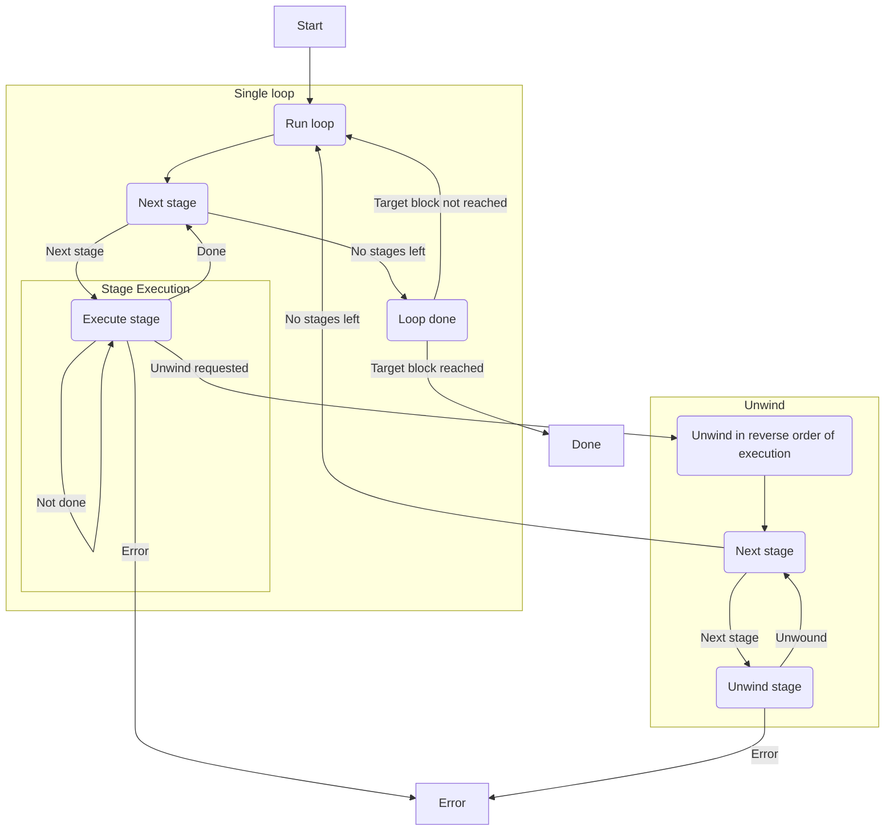

# Stages

The `stages` lib plays a central role in syncing the node, maintaining state, updating the database and more.

When the node is first started, a new `Pipeline` is initialized and all of the stages are added into `Pipeline.stages`. Then, the `Pipeline::run` function is called, which starts the pipeline, executing all of the stages continuously in an infinite loop. This process syncs the chain, keeping everything up to date with the chain tip.
# Stages api
stage execution flow

## stages [crates/stages/api/src/stage.rs]
The `Stage` trait defines the behavior and requirements for a stage in the syncing process of a node.

1. **Purpose**:
    
    - A stage represents a segmented part of the syncing process, handling specific tasks like downloading headers or executing transactions and persisting results to a database.
2. **Requirements**:
    
    - Each stage must have a unique ID (`id`) and implement methods to "roll forwards" (`execute`) and "roll back" (`unwind`).
    - Stages are executed serially as part of a pipeline.
    - Stages receive a `DBProvider` for interacting with the database.
3. **Methods**:
    
    - `id`: Returns the unique ID of the stage.
    - `poll_execute_ready`: Indicates if the stage is ready to execute a given range. It should handle any asynchronous tasks or communication needed before execution.
    - `execute`: Executes the stage, writing necessary data to the database.
    - `post_execute_commit`: Hook called after execution for any post-execution actions.
    - `unwind`: Rolls back the stage, typically used when an error occurs or to revert changes.
    - `post_unwind_commit`: Hook called after unwinding for any post-unwind actions.
4. **Additional Traits**:
    
    - `StageExt`: An extension trait for `Stage` that provides a utility method `execute_ready` to simplify invoking `poll_execute_ready` with a `Future` output.
5. **Concurrency and Asynchronicity**:
    
    - The trait is designed to handle asynchronous operations, as seen in `poll_execute_ready` and `execute_ready`, allowing stages to manage resources and handle errors effectively.

By implementing the `Stage` trait for different stage types, the syncing process can be broken down into manageable units, each responsible for specific tasks and ensuring data integrity throughout the process.

### SyncMetrics

The `SyncMetrics` module is designed to handle and report metrics related to the synchronization process. The `SyncMetrics` module is composed of several components that work together to collect, process, and report metrics. These components include `MetricEvent`, `MetricEventsSender`, `MetricsListener`, and the `SyncMetrics` itself.

### Components

1. **MetricEvent**:
    
    - This enum defines the types of events that can be reported. The two main types of events are:
        - `SyncHeight { height }`: Indicates the current height of the synchronization process.
        - `StageCheckpoint { stage_id, checkpoint, max_block_number }`: Represents a checkpoint in a specific stage of the synchronization process.
2. **MetricEventsSender**:
    
    - This is a sender channel used to send `MetricEvent` instances to the `MetricsListener`.
3. **MetricsListener**:
    
    - This struct listens for `MetricEvent` instances and processes them to update the metrics.
    - It implements the `Future` trait, allowing it to be polled in an asynchronous context.

### How It Works

1. **Event Handling**:
    
    - The `handle_event` method in `MetricsListener` is responsible for processing incoming `MetricEvent` instances.
    - When a `SyncHeight` event is received, it triggers the creation of `StageCheckpoint` events for all stages.
    - When a `StageCheckpoint` event is received, it updates the metrics for the specified stage.
    
    ```rust
    fn handle_event(&mut self, event: MetricEvent) {
        trace!(target: "sync::metrics", ?event, "Metric event received");
        match event {
            MetricEvent::SyncHeight { height } => {
                for stage_id in StageId::ALL {
                    self.handle_event(MetricEvent::StageCheckpoint {
                        stage_id,
                        checkpoint: StageCheckpoint {
                            block_number: height,
                            stage_checkpoint: None,
                        },
                        max_block_number: Some(height),
                    });
                }
            }
            MetricEvent::StageCheckpoint { stage_id, checkpoint, max_block_number } => {
                let stage_metrics = self.sync_metrics.get_stage_metrics(stage_id);
    
                stage_metrics.checkpoint.set(checkpoint.block_number as f64);
    
                let (processed, total) = match checkpoint.entities() {
                    Some(entities) => (entities.processed, Some(entities.total)),
                    None => (checkpoint.block_number, max_block_number),
                };
    
                stage_metrics.entities_processed.set(processed as f64);
    
                if let Some(total) = total {
                    stage_metrics.entities_total.set(total as f64);
                }
            }
        }
    }
    ```
    
2. **Polling for Events**:
    
    - The `MetricsListener` struct implements the `Future` trait, which allows it to be polled in an asynchronous context.
    - The `poll` method continuously checks for new events from the `events_rx` channel and processes them using the `handle_event` method.
    
    ```rust
    impl Future for MetricsListener {
        type Output = ();
    
        fn poll(self: Pin<&mut Self>, cx: &mut Context<'_>) -> Poll<Self::Output> {
            let this = self.get_mut();
    
            // Loop until we drain the `events_rx` channel
            loop {
                let Some(event) = ready!(this.events_rx.poll_recv(cx)) else {
                    // Channel has closed
                    return Poll::Ready(())
                };
    
                this.handle_event(event);
            }
        }
    }
    ```
    
3. **Integration with Pipeline**:
    
    - The `SyncMetrics` module is integrated into the pipeline process. For example, when a stage is unwound, a `StageCheckpoint` event is sent to update the metrics.
    
    ```rust
    {
        Ok(unwind_output) => {
            checkpoint = unwind_output.checkpoint;
            info!(
                target: "sync::pipeline",
                stage = %stage_id,
                unwind_to = to,
                progress = checkpoint.block_number,
                done = checkpoint.block_number == to,
                "Stage unwound"
            );
            if let Some(metrics_tx) = &mut self.metrics_tx {
                let _ = metrics_tx.send(MetricEvent::StageCheckpoint {
                    stage_id,
                    checkpoint,
                    // We assume it was set in the previous execute iteration, so it
                    // doesn't change when we unwind.
                    max_block_number: None,
                });
            }
            provider_rw.save_stage_checkpoint(stage_id, checkpoint)?;
    
            self.event_sender
                .notify(PipelineEvent::Unwound { stage_id, result: unwind_output });
    
            // update finalized block if needed
            let last_saved_finalized_block_number =
                provider_rw.last_finalized_block_number()?;
    
            // If None, that means the finalized block is not written so we should
    ```

# Stages pipeline
The `Pipeline` is designed to manage and execute a series of stages in a synchronized manner. The `Pipeline` is responsible for executing a sequence of stages, each of which performs a specific task. The stages are executed serially, meaning one after the other, from the current local chain tip to the external chain tip. The pipeline continues to run until it reaches the chain tip, and it can be configured to run repeatedly unless explicitly stopped.

### Key Components

1. **ProviderFactory**:
    
    - This is used to create a database provider (`provider_rw`) that stages use to interact with the database.
2. **Stages**:
    
    - A vector of stages (`stages`) that are configured to run in a specific order. Each stage is a boxed trait object that implements the `Stage` trait.
3. **EventSender**:
    
    - Used to send events (`PipelineEvent`) that notify about the progress and state of the pipeline.
4. **PipelineProgress**:
    
    - Keeps track of the progress of the pipeline, including the minimum block number achieved by any stage.
5. **Tip Sender**:
    
    - A channel (`tip_tx`) used to set the current chain tip for reverse synchronization.
6. **Metrics Sender**:
    
    - Used to send metrics events.

### Key Methods

1. **builder()**:
    
    - Constructs a pipeline using a `PipelineBuilder`.
2. **minimum_block_number()**:
    
    - Returns the minimum block number achieved by any stage during the execution of the pipeline.
3. **set_tip()**:
    
    - Sets the chain tip for reverse synchronization.
4. **events()**:
    
    - Returns an event stream to listen for pipeline events.

### Execution Flow

1. **Initialization**:
    
    - The pipeline is initialized using the `PipelineBuilder`, which sets up the stages, provider factory, and other components.
2. **Stage Execution**:
    
    - The pipeline iterates through each stage and executes it using the `execute` method. The stage uses the `provider_rw` to interact with the database.
    - During execution, the pipeline sends notifications about its progress using the `event_sender`.
3. **Handling Results**:
    
    - The result of each stage execution is captured. If the execution is successful, the pipeline moves to the next stage. If there is an error, the pipeline may unwind the stages in reverse order to handle the error.
4. **Repeat Execution**:
    
    - After all stages have been executed, the pipeline can be configured to run again unless explicitly stopped.

## mod
This code defines a `Pipeline` struct and its associated methods for managing and executing a staged synchronization pipeline. The pipeline processes stages serially, handles errors by unwinding stages if necessary, and supports continuous synchronization.

### Pipeline struct
```rust
pub struct Pipeline<N: ProviderNodeTypes> {
provider_factory: ProviderFactory<N>,// Factory for creating database providers

/// All configured stages in the order they will be executed.
stages: Vec<BoxedStage<<ProviderFactory<N> as DatabaseProviderFactory>::ProviderRW>>,

max_block: Option<BlockNumber>, // Maximum block number to sync to

// Producer for static files
static_file_producer: StaticFileProducer<ProviderFactory<N>>,

// Sender for events the pipeline emits.
event_sender: EventSender<PipelineEvent>,

/// Keeps track of the progress of the pipeline.
progress: PipelineProgress,

/// A receiver for the current chain tip to sync to.
tip_tx: Option<watch::Sender<B256>>,

metrics_tx: Option<MetricEventsSender>, // Optional sender for metric events
}
```

### Pipeline impl
This code defines methods for the `Pipeline` struct, which manages the execution of various stages in a blockchain synchronization process. It includes methods for constructing a pipeline, setting synchronization tips, registering metrics, running the pipeline, and handling events.

## Example Usage

```rust
let pipeline = Pipeline::builder().build();
pipeline.set_tip(tip);
let events = pipeline.events();
let result = pipeline.run_as_fut(Some(PipelineTarget::Sync(tip))).await;
```

## Code Analysis

### Inputs

- `self`: Reference to the `Pipeline` instance.
- `tip`: A `B256` value representing the chain tip for reverse sync.
- `target`: An optional `PipelineTarget` specifying the synchronization target.

---

### functions

1. **`builder()`**:
    
    - Constructs a new `PipelineBuilder` using the associated type `ProviderRW` from the `ProviderFactory` associated with the generic type `N`.
    - Example usage:
        
        ```rust
        let pipeline_builder = Pipeline::<MyProvider>::builder();
        ```
        
2. **`minimum_block_number()`**:
    
    - Returns the minimum block number achieved by any stage during the execution of the pipeline.
    - Example usage:
        
        ```rust
        if let Some(min_block_number) = pipeline.minimum_block_number() {
            println!("Minimum block number: {}", min_block_number);
        }
        ```
        
3. **`set_tip(tip: B256)`**:
    
    - Sets the chain tip for reverse synchronization using the provided `tip` value.
    - Example usage:
        
        ```rust
        let tip = B256::new(); // Assuming B256 is a valid type
        pipeline.set_tip(tip);
        ```
        
4. **`events()`**:
    
    - Returns an event stream (`EventStream`) for pipeline events.
    - Example usage:
        
        ```rust
        let event_stream = pipeline.events();
        ```
        
5. **`register_metrics()`**:
    
    - Registers progress metrics for each registered stage in the pipeline.
    - Example usage:
        
        ```rust
        pipeline.register_metrics().unwrap_or_else(|err| {
            eprintln!("Error registering metrics: {:?}", err);
        });
        ```
        
6. **`run_as_fut(target: Option<PipelineTarget>)`**:
    
    - Runs the pipeline asynchronously until it reaches the specified `target`.
    - Example usage:
        
        ```rust
        let target = Some(PipelineTarget::Sync(my_tip));
        let fut = pipeline.run_as_fut(target);
        ```
        
7. **`run()`**:
    
    - Runs the pipeline in an infinite loop, terminating early if a maximum block is specified.
    - Example usage:
        
        ```rust
        if let Err(err) = pipeline.run().await {
            eprintln!("Error running pipeline: {:?}", err);
        }
        ```
        
8. **`run_loop()`**:
    
    - Executes each stage in the pipeline, handling progress and errors, and returns the control flow after running the pipeline.
    - Example usage:
        
        ```rust
        let control_flow = pipeline.run_loop().await.unwrap_or_else(|err| {
            eprintln!("Error running pipeline loop: {:?}", err);
            ControlFlow::Terminate
        });
        ```
        
9. **`move_to_static_files()`**:
    
    - Moves data from the database to static files for specific segments based on stage checkpoints.
    - Example usage:
        
        ```rust
        pipeline.move_to_static_files().unwrap_or_else(|err| {
            eprintln!("Error moving data to static files: {:?}", err);
        });
        ```
        
10. **`unwind(to: BlockNumber, bad_block: Option<BlockNumber>)`**:
    
    - Unwinds the stages in reverse order up to the target block. If unwinding is due to a bad block, the number of that block should be specified.
    - Example usage:
        
        ```rust
        let target_block = 1000;
        let bad_block = Some(500);
        pipeline.unwind(target_block, bad_block).unwrap_or_else(|err| {
            eprintln!("Error unwinding stages: {:?}", err);
        });
        ```
        
11. **`execute_stage_to_completion(previous_stage: Option<BlockNumber>, stage_index: usize)`**:
    
    - Executes a single stage in the pipeline to completion, handling progress and errors.
    - Example usage:
        
        ```rust
        let stage_index = 0;
        let control_flow = pipeline.execute_stage_to_completion(None, stage_index).await.unwrap_or_else(|err| {
            eprintln!("Error executing stage: {:?}", err);
            ControlFlow::Terminate
        });
        ```

---

### Outputs

- `PipelineBuilder`: A builder for constructing a `Pipeline`.
- `Option<u64>`: The minimum block number achieved.
- `EventStream<PipelineEvent>`: A stream of pipeline events.
- `PipelineFut<N>`: A future that returns the pipeline and its result.
- `Result<(), PipelineError>`: The result of running the pipeline.
- `Result<ControlFlow, PipelineError>`: The control flow after running the pipeline loop.

## PipelineBuilder
The `PipelineBuilder` struct is designed to facilitate the construction of a `Pipeline` in a modular and flexible manner. Here's a detailed explanation of how `PipelineBuilder` works:

### Structure Definition

```rust
pub struct PipelineBuilder<Provider> {
    stages: Vec<BoxedStage<Provider>>,
    max_block: Option<BlockNumber>,
    tip_tx: Option<watch::Sender<B256>>,
    metrics_tx: Option<MetricEventsSender>,
}
```

- **stages**: A vector that holds the stages of the pipeline in the order they will be executed. Each stage is boxed to allow for dynamic dispatch.
- **max_block**: An optional maximum block number to which the pipeline will sync.
- **tip_tx**: An optional sender for the current chain tip to sync to.
- **metrics_tx**: An optional sender for metric events.

### Methods

#### Adding Stages

```rust
impl<Provider> PipelineBuilder<Provider> {
    pub fn add_stage<S>(mut self, stage: S) -> Self
    where
        S: Stage<Provider> + 'static,
    {
        self.stages.push(Box::new(stage));
        self
    }

    pub fn add_stages<Set: StageSet<Provider>>(mut self, set: Set) -> Self {
        for stage in set.builder().build() {
            self.stages.push(stage);
        }
        self
    }
}
```

- **add_stage**: Adds a single stage to the pipeline. The stage must implement the `Stage` trait for the given `Provider`.
- **add_stages**: Adds a set of stages to the pipeline. The stages can be grouped into a set using a `StageSet`.

#### Configuration Methods

```rust
impl<Provider> PipelineBuilder<Provider> {
    pub const fn with_max_block(mut self, block: BlockNumber) -> Self {
        self.max_block = Some(block);
        self
    }

    pub fn with_tip_sender(mut self, tip_tx: watch::Sender<B256>) -> Self {
        self.tip_tx = Some(tip_tx);
        self
    }

    pub fn with_metrics_tx(mut self, metrics_tx: MetricEventsSender) -> Self {
        self.metrics_tx = Some(metrics_tx);
        self
    }
}
```

- **with_max_block**: Sets the maximum block number for the pipeline.
- **with_tip_sender**: Sets the sender for the current chain tip.
- **with_metrics_tx**: Sets the sender for metric events.

#### Building the Pipeline

```rust
impl<Provider> PipelineBuilder<Provider> {
    pub fn build<N>(
        self,
        provider_factory: ProviderFactory<N>,
        static_file_producer: StaticFileProducer<ProviderFactory<N>>,
    ) -> Pipeline<N>
    where
        N: ProviderNodeTypes,
        ProviderFactory<N>: DatabaseProviderFactory<ProviderRW = Provider>,
    {
        let Self { stages, max_block, tip_tx, metrics_tx } = self;
        Pipeline {
            provider_factory,
            stages,
            max_block,
            static_file_producer,
            tip_tx,
            event_sender: Default::default(),
            progress: Default::default(),
            metrics_tx,
        }
    }
}
```

- **build**: Consumes the `PipelineBuilder` and constructs a `Pipeline` using the provided `ProviderFactory` and `StaticFileProducer`. This method finalizes the configuration and returns a fully constructed `Pipeline`.

### Default and Debug Implementations

```rust
impl<Provider> Default for PipelineBuilder<Provider> {
    fn default() -> Self {
        Self { stages: Vec::new(), max_block: None, tip_tx: None, metrics_tx: None }
    }
}

impl<Provider> std::fmt::Debug for PipelineBuilder<Provider> {
    fn fmt(&self, f: &mut std::fmt::Formatter<'_>) -> std::fmt::Result {
        f.debug_struct("PipelineBuilder")
            .field("stages", &self.stages.iter().map(|stage| stage.id()).collect::<Vec<StageId>>())
            .field("max_block", &self.max_block)
            .finish()
    }
}
```

- **Default**: Provides a default implementation for `PipelineBuilder`, initializing it with empty or `None` values.
- **Debug**: Implements the `Debug` trait for `PipelineBuilder`, allowing it to be formatted using the `{:?}` formatter. This is useful for debugging purposes.

### Usage in Pipeline

```rust
impl<N: ProviderNodeTypes> Pipeline<N> {
    pub fn builder() -> PipelineBuilder<<ProviderFactory<N> as DatabaseProviderFactory>::ProviderRW> {
        PipelineBuilder::default()
    }
}
```

- **builder**: A static method in the `Pipeline` struct that returns a new `PipelineBuilder` initialized with default values.

## ControlFlow
The `ControlFlow` enum is crucial for managing the execution flow of the pipeline. It helps in determining whether the pipeline should continue, unwind, or handle no progress. The `run_loop` method uses `ControlFlow` to execute stages, update progress, and handle different execution states effectively. The `PipelineProgress` struct aids in tracking and updating the pipeline's progress, ensuring smooth execution.
### Enum Definition

The `ControlFlow` enum is defined with three variants:

1. **Unwind**:
    
    - This variant indicates that an unwind operation is required. It contains:
        - `target`: The block number to which the pipeline should unwind.
        - `bad_block`: The block that caused the unwind, encapsulated in a `Box<SealedHeader>`.
2. **Continue**:
    
    - This variant signifies that the pipeline has made progress and should continue executing. It contains:
        - `block_number`: The block number reached by the stage.
3. **NoProgress**:
    
    - This variant indicates that the pipeline made no progress. It contains:
        - `block_number`: An optional block number reached by the stage.

### Methods

The `ControlFlow` enum has several methods to facilitate its usage:

1. **should_continue**:
    
    - This method returns `true` if the pipeline should continue executing stages. It matches against `Continue` and `NoProgress` variants.
    
    ```rust
    pub const fn should_continue(&self) -> bool {
        matches!(self, Self::Continue { .. } | Self::NoProgress { .. })
    }
    ```
    
2. **is_unwind**:
    
    - This method returns `true` if the control flow is `Unwind`.
    
    ```rust
    pub const fn is_unwind(&self) -> bool {
        matches!(self, Self::Unwind { .. })
    }
    ```
    
3. **block_number**:
    
    - This method returns the block number the stage reached if the state is not `Unwind`.
    
    ```rust
    pub const fn block_number(&self) -> Option<BlockNumber> {
        match self {
            Self::Unwind { .. } => None,
            Self::Continue { block_number } => Some(*block_number),
            Self::NoProgress { block_number } => *block_number,
        }
    }
    ```
    

### Usage in Pipeline Execution

The `ControlFlow` enum is used extensively in the `run_loop` method to manage the pipeline's execution flow:

1. **Initialization**:
    
    - The pipeline initializes and prepares to execute stages.
    
    ```rust
    self.move_to_static_files()?;
    ```
    
2. **Stage Execution Loop**:
    
    - The pipeline iterates through its stages, executing each one to completion.
    
    ```rust
    for stage_index in 0..self.stages.len() {
        let stage = &self.stages[stage_index];
        let stage_id = stage.id();
        let next = self.execute_stage_to_completion(previous_stage, stage_index).await?;
    ```
    
3. **Handling Control Flow**:
    
    - Based on the `ControlFlow` returned by `execute_stage_to_completion`, the pipeline updates its progress or handles an unwind.
    
    ```rust
    match next {
        ControlFlow::NoProgress { block_number } => {
            if let Some(block_number) = block_number {
                self.progress.update(block_number);
            }
        }
        ControlFlow::Continue { block_number } => self.progress.update(block_number),
        ControlFlow::Unwind { target, bad_block } => {
            self.unwind(target, Some(bad_block.number))?;
            return Ok(ControlFlow::Unwind { target, bad_block })
        }
    }
    ```
    
4. **Updating Progress**:
    
    - The pipeline updates its progress based on the block number reached by the stage.
    
    ```rust
    previous_stage = Some(
        self.provider_factory
            .provider()?
            .get_stage_checkpoint(stage_id)?
            .unwrap_or_default()
            .block_number,
    );
    ```
    
5. **Final Control Flow**:
    
    - The pipeline determines the next control flow step based on the progress.
    
    ```rust
    Ok(self.progress.next_ctrl())
    ```
    

### Pipeline Progress

The `PipelineProgress` struct helps in tracking the progress of the pipeline:

- **Fields**:
    
    - `block_number`: The block number reached by the stage.
    - `maximum_block_number`: The maximum block number achieved by any stage.
    - `minimum_block_number`: The minimum block number achieved by any stage.
- **Methods**:
    
    - `update`: Updates the progress with a new block number.
    - `next_ctrl`: Determines the next control flow step based on the current progress.
    
    ```rust
    pub(crate) const fn next_ctrl(&self) -> ControlFlow {
        match self.block_number {
            Some(block_number) => ControlFlow::Continue { block_number },
            None => ControlFlow::NoProgress { block_number: None },
        }
    }
    ```

## PipelineEvent
The `PipelineEvent` enum represents various events that can occur during the execution of a pipeline. Each variant of the enum corresponds to a specific type of event, and it carries relevant data associated with that event. Here's a detailed explanation of each variant:

1. **Prepare**:
    
    - **Description**: This event is emitted when a stage is about to be prepared for a run.
    - **Fields**:
        - `pipeline_stages_progress`: Indicates the progress of the pipeline stages.
        - `stage_id`: Identifies the stage that is about to be run.
        - `checkpoint`: The previous checkpoint of the stage, if any.
        - `target`: The block number up to which the stage is running, if known.
2. **Run**:
    
    - **Description**: This event is emitted when a stage is about to be run.
    - **Fields**:
        - `pipeline_stages_progress`: Indicates the progress of the pipeline stages.
        - `stage_id`: Identifies the stage that is about to be run.
        - `checkpoint`: The previous checkpoint of the stage, if any.
        - `target`: The block number up to which the stage is running, if known.
3. **Ran**:
    
    - **Description**: This event is emitted when a stage has run a single time.
    - **Fields**:
        - `pipeline_stages_progress`: Indicates the progress of the pipeline stages.
        - `stage_id`: Identifies the stage that was run.
        - `result`: The result of executing the stage, encapsulated in an `ExecOutput`.
4. **Unwind**:
    
    - **Description**: This event is emitted when a stage is about to be unwound.
    - **Fields**:
        - `stage_id`: Identifies the stage that is about to be unwound.
        - `input`: The unwind parameters, encapsulated in an `UnwindInput`.
5. **Error**:
    
    - **Description**: This event is emitted when a stage encounters an error either during execution or unwinding.
    - **Fields**:
        - `stage_id`: Identifies the stage that encountered an error.
6. **Skipped**:
    
    - **Description**: This event is emitted when a stage was skipped due to its run conditions not being met. The documentation provides several reasons why a stage might be skipped:
        - The stage might have progressed beyond the point of the target block.
        - The stage might not need to be unwound since it has not progressed past the unwind target.
        - The stage requires that the pipeline has reached the tip, but it has not done so yet.
    - **Fields**:
        - `stage_id`: Identifies the stage that was skipped.

### Example Usage

The `PipelineEvent` enum is used to track and handle different stages of the pipeline's execution. Here are some examples of how these events might be instantiated:

```rust
let events = [
    PipelineEvent::Prepare {
        pipeline_stages_progress: PipelineStagesProgress { current: 1, total: 2 },
        stage_id: StageId::Other("A"),
        checkpoint: None,
        target: Some(10),
    },
    PipelineEvent::Run {
        pipeline_stages_progress: PipelineStagesProgress { current: 1, total: 2 },
        stage_id: StageId::Other("A"),
        checkpoint: None,
        target: Some(10),
    },
    PipelineEvent::Ran {
        pipeline_stages_progress: PipelineStagesProgress { current: 1, total: 2 },
        stage_id: StageId::Other("A"),
        result: ExecOutput { checkpoint: StageCheckpoint::new(20), done: true },
    },
    PipelineEvent::Error { stage_id: StageId::Other("B") },
    PipelineEvent::Skipped { stage_id: StageId::Other("C") },
];
```

### Imports

To use `PipelineEvent` and its associated types, ensure you have the necessary imports:

```rust
use crate::{
    stage::{ExecOutput, UnwindInput, UnwindOutput},
    StageCheckpoint, StageId,
};
use alloy_primitives::BlockNumber;
use std::fmt::{Display, Formatter};
```

This enum provides a structured way to handle and respond to various stages and events in the pipeline, making it easier to manage the pipeline's execution flow and handle errors or special conditions appropriately.

## PipelineProgress
The `PipelineProgress` struct is designed to track the progress of a pipeline in terms of block numbers. It keeps track of the current block number, as well as the minimum and maximum block numbers achieved by any stage during the execution of the pipeline. Here's a detailed explanation of how it works:

### Structure Definition

```rust
#[derive(Debug, Default)]
pub(crate) struct PipelineProgress {
    /// Block number reached by the stage.
    pub(crate) block_number: Option<BlockNumber>,
    /// The maximum block number achieved by any stage during the execution of the pipeline.
    pub(crate) maximum_block_number: Option<BlockNumber>,
    /// The minimum block number achieved by any stage during the execution of the pipeline.
    pub(crate) minimum_block_number: Option<BlockNumber>,
}
```

- `block_number`: This field holds the current block number reached by the stage.
- `maximum_block_number`: This field holds the maximum block number achieved by any stage during the execution of the pipeline.
- `minimum_block_number`: This field holds the minimum block number achieved by any stage during the execution of the pipeline.

### Methods

#### `update`

```rust
impl PipelineProgress {
    pub(crate) fn update(&mut self, block_number: BlockNumber) {
        self.block_number = Some(block_number);
        self.minimum_block_number = opt::min(self.minimum_block_number, block_number);
        self.maximum_block_number = opt::max(self.maximum_block_number, block_number);
    }
}
```

The `update` method updates the `block_number` to the provided value and recalculates the `minimum_block_number` and `maximum_block_number` using the `opt::min` and `opt::max` utility functions, respectively.

- `opt::min`: This function updates the `minimum_block_number` to the smaller of the current `minimum_block_number` and the provided `block_number`.
- `opt::max`: This function updates the `maximum_block_number` to the larger of the current `maximum_block_number` and the provided `block_number`.

#### `next_ctrl`

```rust
impl PipelineProgress {
    /// Get next control flow step
    pub(crate) const fn next_ctrl(&self) -> ControlFlow {
        match self.block_number {
            Some(block_number) => ControlFlow::Continue { block_number },
            None => ControlFlow::NoProgress { block_number: None },
        }
    }
}
```

The `next_ctrl` method determines the next control flow step based on the current `block_number`:

- If `block_number` is `Some`, it returns `ControlFlow::Continue` with the current `block_number`.
- If `block_number` is `None`, it returns `ControlFlow::NoProgress` with `block_number` set to `None`.

## StageSet
The `StageSet` trait and `StageSetBuilder` struct provide a robust framework for managing a collection of stages that need to be executed in a specific order. By using the builder pattern, it allows for flexible configuration, addition, removal, and reordering of stages, making it easier to manage complex workflows with interdependent stages.
### Overview

1. **Definition**:
    
    - `StageSet` is a trait that defines a set of stages that can be configured, added, removed, or overridden.
    - It provides methods to build and configure these stages using a builder pattern.
2. **Purpose**:
    
    - To group stages that have dependencies on each other.
    - To provide a flexible way to manage these stages, including adding, removing, and reordering them.

### Key Components

1. **StageSet Trait**:
    
    - The `StageSet` trait defines two primary methods:
        - `builder(self) -> StageSetBuilder<Provider>`: This method returns a `StageSetBuilder` which is used to configure the stages in the set.
        - `set<S: Stage<Provider> + 'static>(self, stage: S) -> StageSetBuilder<Provider>`: This method overrides a given stage in the set. It panics if the stage is not in the set.
2. **StageSetBuilder**:
    
    - The `StageSetBuilder` is a helper struct that provides methods to add, remove, and reorder stages within the set.
    - Key methods include:
        - `add_stage<S: Stage<Provider> + 'static>(self, stage: S) -> Self`: Adds a stage to the end of the set.
        - `add_stage_opt<S: Stage<Provider> + 'static>(self, stage: Option<S>) -> Self`: Adds a stage to the end of the set if it is `Some`.
        - `add_set<Set: StageSet<Provider>>(self, set: Set) -> Self`: Adds another `StageSet` to the end of the current set.
        - `add_before<S: Stage<Provider> + 'static>(self, stage: S, before: StageId) -> Self`: Adds a stage before another specified stage in the set.
3. **StageEntry**:
    
    - `StageEntry` is a struct that holds a stage and a boolean indicating whether the stage is enabled.
    - It implements the `Debug` trait for easier debugging and logging.

### Example Usage

Here’s a practical example of how `StageSet` and `StageSetBuilder` might be used:

```rust
impl<Provider> StageSet<Provider> for HashingStages
where
    MerkleStage: Stage<Provider>,
    AccountHashingStage: Stage<Provider>,
    StorageHashingStage: Stage<Provider>,
{
    fn builder(self) -> StageSetBuilder<Provider> {
        StageSetBuilder::default()
            .add_stage(MerkleStage::default_unwind())
            .add_stage(AccountHashingStage::new(
                self.stages_config.account_hashing,
                self.stages_config.etl.clone(),
            ))
            .add_stage(StorageHashingStage::new(
                self.stages_config.storage_hashing,
                self.stages_config.etl.clone(),
            ))
            .add_stage(MerkleStage::new_execution(self.stages_config.merkle.clean_threshold))
    }
}
```

In this example:

- `HashingStages` implements the `StageSet` trait.
- The `builder` method uses `StageSetBuilder` to add multiple stages (`MerkleStage`, `AccountHashingStage`, `StorageHashingStage`) to the set.
- Each stage is configured with specific parameters and added to the builder.


# Stages
Each stage within the pipeline implements the `Stage` trait which provides function interfaces to get the stage id, execute the stage and unwind the changes to the database if there was an issue during the stage execution.

## HeaderStage

  

<!-- TODO: Cross-link to eth/65 chapter when it's written -->

The `HeaderStage` is responsible for syncing the block headers, validating the header integrity and writing the headers to the database. When the `execute()` function is called, the local head of the chain is updated to the most recent block height previously executed by the stage. At this point, the node status is also updated with that block's height, hash and total difficulty. These values are used during any new eth/65 handshakes. After updating the head, a stream is established with other peers in the network to sync the missing chain headers between the most recent state stored in the database and the chain tip. The `HeaderStage` contains a `downloader` attribute, which is a type that implements the `HeaderDownloader` trait. A `HeaderDownloader` is a `Stream` that returns batches of headers.

  

[File: crates/interfaces/src/p2p/headers/downloader.rs](https://github.com/paradigmxyz/reth/blob/1563506aea09049a85e5cc72c2894f3f7a371581/crates/interfaces/src/p2p/headers/downloader.rs)

```rust,ignore

pub trait HeaderDownloader: Send + Sync + Stream<Item = Vec<SealedHeader>> + Unpin {

/// Updates the gap to sync which ranges from local head to the sync target

///

/// See also [HeaderDownloader::update_sync_target] and [HeaderDownloader::update_local_head]

fn update_sync_gap(&mut self, head: SealedHeader, target: SyncTarget) {

self.update_local_head(head);

self.update_sync_target(target);

}

  

/// Updates the block number of the local database

fn update_local_head(&mut self, head: SealedHeader);

  

/// Updates the target we want to sync to

fn update_sync_target(&mut self, target: SyncTarget);

  

/// Sets the headers batch size that the Stream should return.

fn set_batch_size(&mut self, limit: usize);

}

```

  

The `HeaderStage` relies on the downloader stream to return the headers in descending order starting from the chain tip down to the latest block in the database. While other stages in the `Pipeline` start from the most recent block in the database up to the chain tip, the `HeaderStage` works in reverse to avoid [long-range attacks](https://messari.io/report/long-range-attack). When a node downloads headers in ascending order, it will not know if it is being subjected to a long-range attack until it reaches the most recent blocks. To combat this, the `HeaderStage` starts by getting the chain tip from the Consensus Layer, verifies the tip, and then walks backwards by the parent hash. Each value yielded from the stream is a `SealedHeader`.

  

[File: crates/primitives/src/header.rs](https://github.com/paradigmxyz/reth/blob/1563506aea09049a85e5cc72c2894f3f7a371581/crates/primitives/src/header.rs)

```rust,ignore

pub struct SealedHeader {

/// Locked Header fields.

header: Header,

/// Locked Header hash.

hash: BlockHash,

}

```

  

<!-- Not sure about this, how is it validated? -->

Each `SealedHeader` is then validated to ensure that it has the proper parent. Note that this is only a basic response validation, and the `HeaderDownloader` uses the `validate` method during the `stream`, so that each header is validated according to the consensus specification before the header is yielded from the stream. After this, each header is then written to the database. If a header is not valid or the stream encounters any other error, the error is propagated up through the stage execution, the changes to the database are unwound and the stage is resumed from the most recent valid state.

  

This process continues until all of the headers have been downloaded and written to the database. Finally, the total difficulty of the chain's head is updated and the function returns `Ok(ExecOutput { stage_progress, done: true })`, signaling that the header sync has been completed successfully.


  

## BodyStage

  

Once the `HeaderStage` completes successfully, the `BodyStage` will start execution. The body stage downloads block bodies for all of the new block headers that were stored locally in the database. The `BodyStage` first determines which block bodies to download by checking if the block body has an ommers hash and transaction root.

  

An ommers hash is the Keccak 256-bit hash of the ommers list portion of the block. If you are unfamiliar with ommers blocks, you can [click here to learn more](https://ethereum.org/en/glossary/#ommer). Note that while ommers blocks were important for new blocks created during Ethereum's proof of work chain, Ethereum's proof of stake chain selects exactly one block proposer at a time, causing ommers blocks not to be needed in post-merge Ethereum.

  

The transactions root is a value that is calculated based on the transactions included in the block. To derive the transactions root, a [merkle tree](https://blog.ethereum.org/2015/11/15/merkling-in-ethereum) is created from the block's transactions list. The transactions root is then derived by taking the Keccak 256-bit hash of the root node of the merkle tree.

  

When the `BodyStage` is looking at the headers to determine which block to download, it will skip the blocks where the `header.ommers_hash` and the `header.transaction_root` are empty, denoting that the block is empty as well.

  

Once the `BodyStage` determines which block bodies to fetch, a new `bodies_stream` is created which downloads all of the bodies from the `starting_block`, up until the `target_block` specified. Each time the `bodies_stream` yields a value, a `SealedBlock` is created using the block header, the ommers hash and the newly downloaded block body.

  

[File: crates/primitives/src/block.rs](https://github.com/paradigmxyz/reth/blob/main/crates/primitives/src/block.rs)

```rust,ignore

pub struct SealedBlock {

/// Locked block header.

pub header: SealedHeader,

/// Transactions with signatures.

pub body: Vec<TransactionSigned>,

/// Ommer/uncle headers

pub ommers: Vec<SealedHeader>,

}

```

  

The new block is then pre-validated, checking that the ommers hash and transactions root in the block header are the same in the block body. Following a successful pre-validation, the `BodyStage` loops through each transaction in the `block.body`, adding the transaction to the database. This process is repeated for every downloaded block body, with the `BodyStage` returning `Ok(ExecOutput { stage_progress, done: true })` signaling it successfully completed.


## SenderRecoveryStage

  

Following a successful `BodyStage`, the `SenderRecoveryStage` starts to execute. The `SenderRecoveryStage` is responsible for recovering the transaction sender for each of the newly added transactions to the database. At the beginning of the execution function, all of the transactions are first retrieved from the database. Then the `SenderRecoveryStage` goes through each transaction and recovers the signer from the transaction signature and hash. The transaction hash is derived by taking the Keccak 256-bit hash of the RLP encoded transaction bytes. This hash is then passed into the `recover_signer` function.

  

[File: crates/primitives/src/transaction/signature.rs](https://github.com/paradigmxyz/reth/blob/1563506aea09049a85e5cc72c2894f3f7a371581/crates/primitives/src/transaction/signature.rs)

```rust,ignore

pub(crate) fn recover_signer(&self, hash: B256) -> Option<Address> {

let mut sig: [u8; 65] = [0; 65];

  

sig[0..32].copy_from_slice(&self.r.to_be_bytes::<32>());

sig[32..64].copy_from_slice(&self.s.to_be_bytes::<32>());

sig[64] = self.odd_y_parity as u8;

  

// NOTE: we are removing error from underlying crypto library as it will restrain primitive

// errors and we care only if recovery is passing or not.

secp256k1::recover(&sig, hash.as_fixed_bytes()).ok()

}

```

  

In an [ECDSA (Elliptic Curve Digital Signature Algorithm) signature](https://wikipedia.org/wiki/Elliptic_Curve_Digital_Signature_Algorithm), the "r", "s", and "v" values are three pieces of data that are used to mathematically verify the authenticity of a digital signature. ECDSA is a widely used algorithm for generating and verifying digital signatures, and it is often used in cryptocurrencies like Ethereum.

  

The "r" is the x-coordinate of a point on the elliptic curve that is calculated as part of the signature process. The "s" is the s-value that is calculated during the signature process. It is derived from the private key and the message being signed. Lastly, the "v" is the "recovery value" that is used to recover the public key from the signature, which is derived from the signature and the message that was signed. Together, the "r", "s", and "v" values make up an ECDSA signature, and they are used to verify the authenticity of the signed transaction.

  

Once the transaction signer has been recovered, the signer is then added to the database. This process is repeated for every transaction that was retrieved, and similarly to previous stages, `Ok(ExecOutput { stage_progress, done: true })` is returned to signal a successful completion of the stage.

## ExecutionStage

  

Finally, after all headers, bodies and senders are added to the database, the `ExecutionStage` starts to execute. This stage is responsible for executing all of the transactions and updating the state stored in the database. For every new block header added to the database, the corresponding transactions have their signers attached to them and `reth_blockchain_tree::executor::execute_and_verify_receipt()` is called, pushing the state changes resulting from the execution to a `Vec`.

  

[File: crates/stages/src/stages/execution.rs](https://github.com/paradigmxyz/reth/blob/1563506aea09049a85e5cc72c2894f3f7a371581/crates/stages/src/stages/execution.rs)

```rust,ignore

pub fn execute_and_verify_receipt<DB: StateProvider>(

block: &Block,

total_difficulty: U256,

senders: Option<Vec<Address>>,

chain_spec: &ChainSpec,

db: &mut SubState<DB>,

) -> Result<ExecutionResult, Error>

```

  

After all headers and their corresponding transactions have been executed, all of the resulting state changes are applied to the database, updating account balances, account bytecode and other state changes. After applying all of the execution state changes, if there was a block reward, it is applied to the validator's account.

  

At the end of the `execute()` function, a familiar value is returned, `Ok(ExecOutput { stage_progress, done: true })` signaling a successful completion of the `ExecutionStage`.

## MerkleExecuteStage

The MerkleExecuteStage is responsible for updating the Merkle trie, which is a data structure used to efficiently store and verify the state of accounts and storage in the blockchain. This stage processes blocks in a specified range and updates the state root accordingly.

### Execution Process

1. **Stage Initialization**: The stage begins by determining the threshold for execution. If the stage is in the `Unwind` state, it is skipped. Otherwise, the threshold is set based on the `Execution` or `Both` state.
    
2. **Block Range Determination**: The stage calculates the range of blocks to process using the `next_block_range()` method. It retrieves the target block's state root from the provider.
    
3. **Checkpoint Management**: A checkpoint is retrieved to track the execution progress. If the block range is empty or exceeds the threshold, the trie is rebuilt from scratch. Otherwise, an incremental update is performed.
    
4. **Incremental Update**: For incremental updates, the `StateRoot::incremental_root_with_updates()` function is used to compute the new state root and the updates required. These updates are then written to the database.
    
5. **Entities Checkpoint**: The number of processed and total hashed entries is calculated, and an `EntitiesCheckpoint` is created to reflect this.
    
6. **Validation and Completion**: The state root is validated against the sealed block header. The execution checkpoint is reset, and the stage returns `Ok(ExecOutput { checkpoint, done: true })`, indicating successful completion.
  

## MerkleUnwindStage

The `MerkleUnwindStage` is responsible for reverting state changes in the database when a blockchain reorganization occurs. This stage ensures that the state is consistent with the new chain by unwinding the changes made by previously executed blocks.

### Implementation Details

The `MerkleUnwindStage` is implemented as part of the `Stage` trait for the `MerkleStage` struct. It uses the `unwind` method to revert changes. The method takes a `Provider` and an `UnwindInput` as parameters and returns a `Result<UnwindOutput, StageError>`.

```rust
fn unwind(
    &mut self,
    provider: &Provider,
    input: UnwindInput,
) -> Result<UnwindOutput, StageError> {
    self.0.unwind(provider, input)
}
```

### Unwind Process

1. **Checkpoint Retrieval**: The stage retrieves the current checkpoint to determine the block number up to which changes need to be unwound.
    
2. **State Reversion**: The stage iterates over the blocks from the current checkpoint back to the target block number specified in the `UnwindInput`. For each block, it reverts the state changes, including account balances and storage modifications.
    
3. **Trie Updates**: The stage updates the Merkle Trie to reflect the reverted state. This involves recalculating the state root for the affected blocks.
    
4. **Checkpoint Update**: After successfully unwinding the changes, the stage updates the checkpoint to reflect the new state of the database.
    
5. **Output**: The method returns an `UnwindOutput` with the updated checkpoint, signaling the completion of the unwind process.
    

### Example Usage

The `unwind` method is typically called during a blockchain reorganization, where the chain needs to revert to a previous state. This ensures that the database remains consistent with the new chain.

```rust
let result = merkle_stage.unwind(provider, unwind_input);
match result {
    Ok(output) => {
        println!("Unwind successful, new checkpoint: {:?}", output.checkpoint);
    }
    Err(e) => {
        eprintln!("Unwind failed: {:?}", e);
    }
}
```


## AccountHashingStage

The `AccountHashingStage` is responsible for hashing account data and updating the corresponding tables in the database. This stage is crucial for ensuring that account data is efficiently stored and can be quickly accessed during blockchain operations.

### Implementation

The `AccountHashingStage` is implemented as part of the `Stage` trait, which defines the necessary methods for execution and management of stages within the blockchain processing pipeline.

```rust
impl<Provider> Stage<Provider> for AccountHashingStage
where
    Provider: DBProvider<Tx: DbTxMut> + StorageReader + HashingWriter + StatsReader,
{
    fn id(&self) -> StageId {
        StageId::AccountHashing
    }

    fn execute(&mut self, provider: &Provider, input: ExecInput) -> Result<ExecOutput, StageError> {
        let tx = provider.tx_ref();
        if input.target_reached() {
            return Ok(ExecOutput::done(input.checkpoint()))
        }

        let (from_block, to_block) = input.next_block_range().into_inner();

        // If the number of blocks exceeds the clean threshold or if starting from genesis,
        // hash all accounts from the plain state. Otherwise, aggregate changesets and apply
        // hashing to the AccountHashing table.
        if to_block - from_block > self.clean_threshold || from_block == 1 {
            // Hashing logic for accounts
        }

        // Return the execution result
        Ok(ExecOutput {
            checkpoint: StageCheckpoint::new(to_block),
            done: true,
        })
    }
}
```

### Execution Logic

1. **Initialization**: The stage begins by checking if the target block has been reached. If so, it returns a completed `ExecOutput`.
    
2. **Block Range Calculation**: It calculates the range of blocks to process, determining the starting and ending block numbers.
    
3. **Hashing Strategy**:
    
    - If the number of blocks exceeds the `clean_threshold` or if starting from the genesis block, it hashes all accounts from the plain state.
    - Otherwise, it aggregates changesets and applies hashing to the `AccountHashing` table.
4. **Completion**: Upon successful execution, it returns an `ExecOutput` with the updated checkpoint and a `done` status set to `true`.
  
## StorageHashingStage

The `StorageHashingStage` is a critical component in the process of maintaining the integrity and efficiency of the blockchain state. This stage is responsible for hashing the storage data of accounts, ensuring that the state is correctly represented in a hashed form, which is essential for efficient state verification and retrieval.

### Default Configuration

The `StorageHashingStage` is initialized with default parameters that dictate its behavior:

```rust
impl Default for StorageHashingStage {
    fn default() -> Self {
        Self {
            clean_threshold: 500_000,
            commit_threshold: 100_000,
            etl_config: EtlConfig::default(),
        }
    }
}
```

- **clean_threshold**: This parameter determines the block range size at which it is more efficient to hash the entire state rather than just the changes. If the number of blocks exceeds this threshold, a full state hash is performed.
- **commit_threshold**: This parameter sets the block range size at which changes are committed to the database.
- **etl_config**: Configuration for Extract-Transform-Load operations, initialized with default settings.

### Execution Logic

The `execute()` function is the core of the `StorageHashingStage`, responsible for carrying out the hashing process:

```rust
impl<Provider> Stage<Provider> for StorageHashingStage
where
    Provider: DBProvider<Tx: DbTxMut> + StorageReader + HashingWriter + StatsReader,
{
    fn execute(&mut self, provider: &Provider, input: ExecInput) -> Result<ExecOutput, StageError> {
        let tx = provider.tx_ref();
        if input.target_reached() {
            return Ok(ExecOutput::done(input.checkpoint()))
        }

        let (from_block, to_block) = input.next_block_range().into_inner();

        if to_block - from_block > self.clean_threshold || from_block == 1 {
            // Perform full state hashing if the block range exceeds the clean threshold
            // or if starting from the genesis block.
        }
    }
}
```

- **Provider**: The `Provider` is a trait that must be implemented by any database provider used in this stage. It includes traits for database transactions, storage reading, hashing writing, and statistics reading.
- **Execution Flow**: The function checks if the target block has been reached. If so, it returns a completion signal. Otherwise, it calculates the block range and decides whether to perform full state hashing or incremental hashing based on the `clean_threshold`.

### Test Runner

The `StorageHashingTestRunner` is used for testing the execution of the `StorageHashingStage`:

```rust
impl ExecuteStageTestRunner for StorageHashingTestRunner {
    type Seed = Vec<SealedBlock>;

    fn seed_execution(&mut self, input: ExecInput) -> Result<Self::Seed, TestRunnerError> {
        let stage_progress = input.next_block();
        let end = input.target();
        let mut rng = generators::rng();

        let n_accounts = 31;
        let mut accounts = random_contract_account_range(&mut rng, &mut (0..n_accounts));

        let blocks = random_block_range(
            &mut rng,
            stage_progress..=end,
            BlockRangeParams { parent: Some(B256::ZERO), tx_count: 0..3, ..Default::default() },
        );

        self.db.insert_headers(blocks.iter().map(|block| &block.header))?;
        Ok(blocks)
    }
}
```

- **Seed Execution**: This function seeds the test runner with a range of random blocks and accounts, simulating the conditions under which the `StorageHashingStage` would operate.
- **Database Interaction**: Headers for the generated blocks are inserted into the database, preparing the environment for the execution tests.


## TransactionLookupStage

The `TransactionLookupStage` is a crucial component in the transaction processing pipeline. This stage is responsible for indexing transactions within blocks, allowing for efficient transaction retrieval and lookup. It ensures that each transaction is correctly associated with its respective block and stored in the database for future queries.

### Key Responsibilities

1. **Transaction Indexing**: For every block processed, the `TransactionLookupStage` indexes each transaction, associating it with the block number and other relevant metadata. This indexing facilitates quick and efficient transaction lookups.
    
2. **Database Updates**: The stage updates the database with the indexed transactions, ensuring that the transaction data is stored in a structured and accessible manner. This involves inserting transaction records into the appropriate database tables.
    
3. **Execution and Validation**: The stage executes the transaction indexing process and validates the results to ensure data integrity. It uses the `TransactionLookupTestRunner` to simulate and verify the indexing process, ensuring that all transactions are correctly indexed and stored.
    

### Execution Flow

- **Setup**: The stage initializes with a target block and a checkpoint indicating the current progress. It prepares the necessary resources and configurations for transaction indexing.
    
- **Transaction Insertion**: Using a random block generator, the stage inserts blocks with transactions into the database. It ensures that each block contains the correct number of transactions, as specified by the input parameters.
    
- **Execution**: The stage executes the transaction indexing process, processing each block and indexing its transactions. It uses the `execute()` function to carry out this process, which returns a result indicating the success or failure of the execution.
    
- **Validation**: After execution, the stage validates the indexed transactions to ensure accuracy and completeness. It checks that all transactions are correctly indexed and that the database reflects the expected state.
    
- **Completion**: Upon successful execution and validation, the stage returns `Ok(ExecOutput { stage_progress, done: true })`, indicating that the transaction indexing process is complete and successful.


## IndexStorageHistoryStage

The `IndexStorageHistoryStage` is responsible for indexing storage changes in the blockchain. This stage processes each block and updates the storage history in the database, ensuring that all changes to storage are properly recorded and can be queried efficiently.

### Functionality

1. **Initialization**: The stage initializes by setting up necessary configurations and preparing the database for indexing operations. It retrieves the starting block and the target block for processing.
    
2. **Processing Blocks**: For each block within the specified range, the stage retrieves the storage changes. It iterates over all transactions in the block, extracting storage modifications and recording them in the database.
    
3. **Indexing Storage Changes**: The storage changes are indexed by updating the relevant tables in the database. This involves writing the changes to a storage history table, which keeps track of all modifications for efficient querying.
    
4. **Handling Errors**: The stage includes error handling mechanisms to manage any issues that arise during processing. If a block cannot be processed due to missing data or other errors, the stage logs the error and continues with the next block.
    
5. **Completion**: Once all blocks have been processed, the stage finalizes the indexing operation. It ensures that all changes are committed to the database and returns a result indicating successful completion.
    

### Code Structure

- **Struct Definition**: The `IndexStorageHistoryStage` struct holds the necessary components for indexing, such as database connections and configuration parameters.
    
- **Methods**:
    
    - `execute()`: The main method that orchestrates the indexing process. It handles block retrieval, processing, and error management.
    - `index_storage_changes()`: A helper method that performs the actual indexing of storage changes for a given block.
- **Return Value**: At the end of the `execute()` function, the stage returns `Ok(ExecOutput { stage_progress, done: true })`, indicating that the indexing operation was completed successfully.

<br>

  

## IndexAccountHistoryStage

The `IndexAccountHistoryStage` is a crucial component in the process of maintaining an accurate and up-to-date history of account changes within the database. This stage is responsible for indexing changes to account states, ensuring that any modifications to account balances, nonces, or other attributes are properly recorded and can be efficiently queried.

### Process Overview

1. **Setup**: Before execution, the database is prepared with necessary data. This involves committing block body indices and account change sets to the database. The `partial_setup` function demonstrates this by iterating over blocks and applying changesets to the history index.
    
2. **Execution**: The stage is executed using the `run` function, which sets up the execution input, including the target block number and any existing checkpoints. The `IndexAccountHistoryStage` is then executed, processing the changes and updating the history index accordingly.
    
3. **Verification**: After execution, the output is verified to ensure that the stage has completed successfully. This is done by comparing the expected output with the actual result, ensuring that the checkpoint is updated correctly and that the execution is marked as done.
    
4. **Commit**: Once the execution is verified, the changes are committed to the database, solidifying the updates to the account history.
    

### Key Functions

- **`partial_setup`**: Prepares the database with block body indices and account change sets, setting the stage for execution.
- **`run`**: Executes the stage with the provided input, processes the changes, and verifies the output.
- **`execute`**: The core function that processes the account history changes, updating the database with new indices.

### Return Value

At the end of the `execute()` function, the stage returns `Ok(ExecOutput { checkpoint: StageCheckpoint::new(run_to), done: true })`, indicating that the `IndexAccountHistoryStage` has completed successfully and the database is updated with the latest account history changes.


## FinishStage

The `FinishStage` is the final stage in the synchronization process. It is responsible for marking the highest fully synchronized block in the blockchain. Unlike other stages, the `FinishStage` does not perform any data writing or state changes; its primary role is to update the checkpoint to indicate the completion of the synchronization process.

### Implementation Details

The `FinishStage` is implemented as a struct that derives from `Default`, `Debug`, and `Clone`, and is marked as `non_exhaustive`, indicating that additional fields may be added in the future without breaking existing code.

```rust
#[derive(Default, Debug, Clone)]
#[non_exhaustive]
pub struct FinishStage;
```

### Stage Implementation

The `FinishStage` implements the `Stage` trait for a generic `Provider`. This trait requires the implementation of several methods, including `id`, `execute`, and `unwind`.

#### Stage ID

The `id` method returns a unique identifier for the stage, which is `StageId::Finish`.

```rust
fn id(&self) -> StageId {
    StageId::Finish
}
```

#### Execute Method

The `execute` method is responsible for updating the checkpoint to the target block specified in the `ExecInput`. It returns an `ExecOutput` with the updated checkpoint and a `done` flag set to `true`, indicating that the stage has completed successfully.

```rust
fn execute(
    &mut self,
    _provider: &Provider,
    input: ExecInput,
) -> Result<ExecOutput, StageError> {
    Ok(ExecOutput { checkpoint: StageCheckpoint::new(input.target()), done: true })
}
```

#### Unwind Method

The `unwind` method allows the stage to revert to a previous state if necessary. It updates the checkpoint to the specified `unwind_to` block in the `UnwindInput`.

```rust
fn unwind(
    &mut self,
    _provider: &Provider,
    input: UnwindInput,
) -> Result<UnwindOutput, StageError> {
    Ok(UnwindOutput { checkpoint: StageCheckpoint::new(input.unwind_to) })
}
```


## PruneStage

The `PruneStage` is responsible for cleaning up unnecessary data from the database to optimize storage and performance. This stage specifically targets the removal of transaction senders that are no longer needed after certain blocks have been processed.

### Implementation Details

The `PruneStage` is implemented as a part of the `Stage` trait, specifically for the `PruneSenderRecoveryStage`. It utilizes a provider that implements several traits, including `DBProvider`, `PruneCheckpointReader`, `PruneCheckpointWriter`, `BlockReader`, and `StaticFileProviderFactory`. These traits ensure that the stage has access to the necessary database operations and checkpoint management.

#### Execution

The `execute` function of the `PruneSenderRecoveryStage` is responsible for performing the pruning operation. It first calls the `execute` method of its inner stage to perform any preliminary operations. If the execution is not complete, it retrieves the prune checkpoint for the `SenderRecovery` segment. This checkpoint indicates the highest block number that has been pruned. The function then updates the execution result's checkpoint to reflect this block number.

```rust
fn execute(&mut self, provider: &Provider, input: ExecInput) -> Result<ExecOutput, StageError> {
    let mut result = self.0.execute(provider, input)?;

    if !result.done {
        let checkpoint = provider
            .get_prune_checkpoint(PruneSegment::SenderRecovery)?
            .ok_or(StageError::MissingPruneCheckpoint(PruneSegment::SenderRecovery))?;

        result.checkpoint = StageCheckpoint::new(checkpoint.block_number.unwrap_or_default());
    }

    Ok(result)
}
```

#### Validation

The `validate_execution` function ensures that the pruning operation was successful. It checks that the execution output's checkpoint matches the expected prune checkpoint and verifies that the transaction senders within the specified block range have been removed.

```rust
fn validate_execution(
    &self,
    input: ExecInput,
    output: Option<ExecOutput>,
) -> Result<(), TestRunnerError> {
    if let Some(output) = output {
        let start_block = input.next_block();
        let end_block = output.checkpoint.block_number;

        if start_block > end_block {
            return Ok(())
        }

        let provider = self.db.factory.provider()?;

        assert!(output.done);
        assert_eq!(
            output.checkpoint.block_number,
            provider
                .get_prune_checkpoint(PruneSegment::SenderRecovery)?
                .expect("prune checkpoint must exist")
                .block_number
                .unwrap_or_default()
        );

        let tx_range = provider.transaction_range_by_block_range(start_block..=end_block)?;
        let senders = self.db.factory.provider()?.senders_by_tx_range(tx_range)?;
        assert!(senders.is_empty());
    }
    Ok(())
}
```

